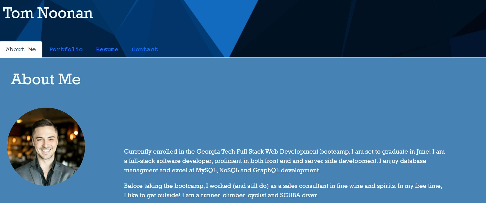

# React Portfolio

## Description:
This is a portfolio documenting my growth as a Developer! It is built using React, and hosts my Resume as well as a selection of the projects that I've worked on.

## Table of Contents:
* [License](#license)
* [Usage](#usage)
* [How to Contribute](#how-to-contribute)

## License:
The MIT License

## Usage:
Visit the page, and click around to navigate!

## How to Contribute:
Contact me via GitHub or Email to contribute.

## Questions:
For questions or comments, you can reach me via:

Email: TNoonan88@gmail.com

GitHub: [TNoonan88](https://github.com/TNoonan88)
